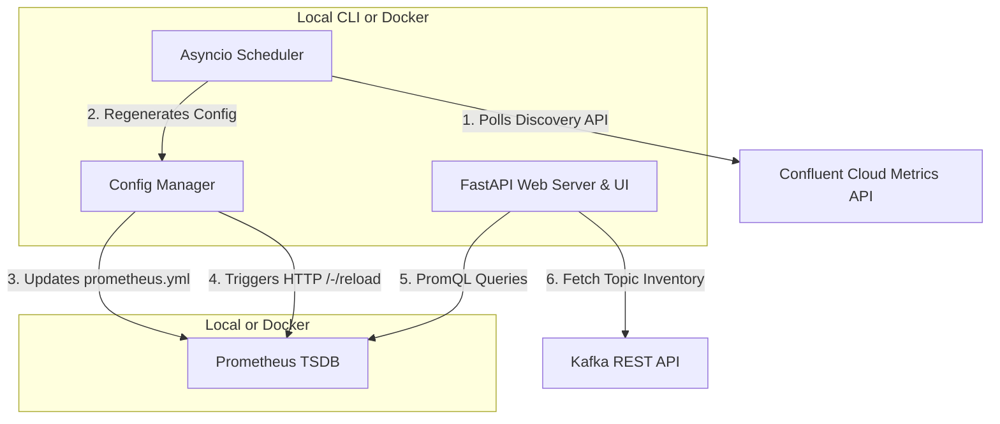

# Task Prompt: Prometheus Dynamic Topic Usage Reporter & Web GUI

This document contains the requirements, architecture, and step-by-step implementation tasks to build a dynamic Confluent Cloud Topic Usage Monitoring dashboard.

---

## 1. Goal & Architecture Overview

The goal is to extend the `prometheus-topic-usage` project so that it:
1. **Scrapes Confluent Cloud Telemetry dynamically** for all available Kafka clusters.
2. **Proactively monitors cluster additions/deletions** (every 3 hours by default) using the `/v2/metrics/cloud/discovery` endpoint.
3. **Hot-reloads Prometheus** when cluster lists change using the HTTP `/-/reload` endpoint.
4. **Provides a premium, responsive Web GUI** (FastAPI backend + Vanilla HTML/CSS/JS glassmorphic frontend) to monitor cluster health, active/unused topics, and traffic levels.
5. **Supports Dual Run Modes**:
   - **Local CLI**: Runs directly in a Python virtual environment (e.g., for local development, scripts, or lightweight environments).
   - **Dockerized**: Fully containerized and orchestrated via Docker Compose.

### Component Diagram



---

## 2. Environment & Configuration Storage

To support running both from the command line and inside a container, configuration and state file paths must be configurable via environment variables.

### Path Variables & Defaults
- `PROMETHEUS_CONFIG_PATH`: Path to the active `prometheus.yml` file.
  - *Local CLI default*: `./prometheus/prometheus.yml`
  - *Docker default*: `/etc/prometheus/prometheus.yml` (mapped via shared volume)
- `PROMETHEUS_URL`: Base URL of the Prometheus server.
  - *Local CLI default*: `http://localhost:9090`
  - *Docker default*: `http://prometheus:9090` (within compose network)
- `CLUSTERS_CONFIG_PATH`: Path to write the JSON configuration file containing discovered clusters and credentials.
  - *Local CLI default*: `./data/clusters_config.json`
  - *Docker default*: `/data/clusters_config.json`

### Environment Variables (.env)
- `CLOUD_API_KEY` / `CLOUD_API_SECRET`: Telemetry credentials used for cluster discovery and metrics scraping.
- `CLUSTER_CHECK_INTERVAL`: Check interval (default: `3h`).
- `PROM_RETENTION_TIME`: Prometheus TSDB retention duration (default: `180d`).
- `PORT`: Web UI dashboard port (default: `8000`).

---

## 3. Step-by-Step Implementation Checklist

### Task 1: Docker Setup & Directory Structure
- [ ] Add a `Dockerfile` for the FastAPI dashboard under `prometheus-topic-usage/app/Dockerfile` using a lightweight Python image (e.g., `python:3.10-slim`).
- [ ] Update [docker-compose.yml](file:///Users/dfederico/projects/customers/cflt.santander.glbcards.topics/prometheus-topic-usage/docker-compose.yml) to include the new `cflt-dashboard` container service:
  - Mount `./prometheus/` as a shared volume directory (to let the dashboard rewrite `prometheus.yml`).
  - Set the appropriate environment paths:
    ```yaml
    environment:
      - PROMETHEUS_CONFIG_PATH=/etc/prometheus/prometheus.yml
      - PROMETHEUS_URL=http://prometheus:9090
      - CLUSTERS_CONFIG_PATH=/data/clusters_config.json
    ```
- [ ] Ensure the Prometheus service mounts the same `./prometheus/prometheus.yml` path.

### Task 2: FastAPI Web App & Scheduler Backend
- [ ] Create a Python web app using **FastAPI** inside a new folder structure under `prometheus-topic-usage/app`.
- [ ] Implement the **Config Manager**:
  - Handles reading and updating the list of discovered clusters in `CLUSTERS_CONFIG_PATH`.
  - Generates the `prometheus.yml` configuration dynamically containing a scrape job for every discovered cluster.
  - Sends a POST request to `${PROMETHEUS_URL}/-/reload` when the configuration changes.
- [ ] Implement the **Discovery Scheduler**:
  - Runs inside the FastAPI process (using `asyncio.create_task` or a background worker loop).
  - Triggers every `CLUSTER_CHECK_INTERVAL` (e.g. `3h`).
  - Fetches the active list of cluster IDs from Confluent Cloud Metrics Discovery:
    - Path: `GET https://api.telemetry.confluent.cloud/v2/metrics/cloud/discovery` (or `/v2/metrics/cloud/descriptors/resources`)
    - Headers: Basic auth with telemetry credentials.
  - Updates the clusters configuration list and reloads Prometheus.
- [ ] Implement the **Dashboard API endpoints**:
  - `GET /api/clusters`: Returns the list of discovered clusters, their configuration statuses, and basic metadata.
  - `POST /api/clusters/{cluster_id}/config`: Updates the REST endpoint and API credentials for a specific cluster.
  - `GET /api/clusters/{cluster_id}/usage`:
    - Queries Prometheus PromQL for `bytes_in` and `bytes_out` for all topics over a configurable duration (default: `30d`).
    - Connects to the cluster's Kafka REST API (if credentials are set) to fetch the complete active topic inventory.
    - Groups and matches topics to identify active topics, unused topics (where metrics sum is 0 or no time-series exists), and returns detailed counts.

### Task 3: Modern Glassmorphic Web UI
- [ ] Build a sleek, single-page application dashboard using vanilla JS/CSS:
  - **Styles**: Glassmorphism (`backdrop-filter: blur()`), glowing borders, dynamic gradients, smooth transitions, dark mode-first.
  - **Overview Page**:
    - Cards for each discovered cluster showing: Cluster ID, name (if set), number of total/active/unused topics, config status (configured vs. missing credentials).
    - Status indicator showing when the next dynamic discovery run is scheduled.
  - **Credential Modal**:
    - Clicking on a cluster card that is "missing credentials" opens a glassmorphic modal to enter the Kafka REST endpoint, Key, and Secret.
  - **Drill-down Page / Panel**:
    - Displays a searchable, sortable list of all topics in a selected cluster.
    - Interactive filters: Show All, Show Active, Show Unused.
    - Columns: Topic Name, Bytes In (Formatted), Bytes Out (Formatted), Status Badge.

### Task 4: Verification & Manual Testing
- [ ] **Run option A (Local CLI)**:
  - Launch Prometheus in Docker container or locally.
  - Start the FastAPI application locally:
    ```bash
    cd prometheus-topic-usage/app
    pip install -r requirements.txt
    uvicorn main:app --port 8000
    ```
  - Verify that the app discovers clusters, updates the local `./prometheus/prometheus.yml`, and triggers a reload on `http://localhost:9090/-/reload`.
- [ ] **Run option B (Dockerized)**:
  - Run the complete stack using `docker compose up --build`.
  - Verify Prometheus correctly parses the generated `/etc/prometheus/prometheus.yml` inside the container after discovery reloads.
- [ ] Test entering invalid credentials for a cluster and verify the UI handles the API errors gracefully.

